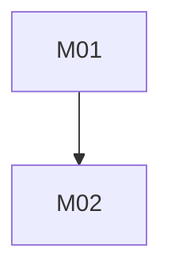
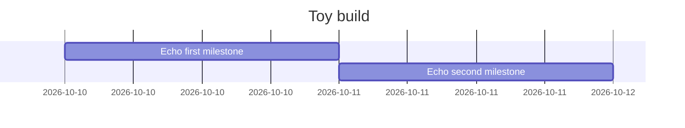

# Toy orchestration comparison

Copy this folder to a temporary git repository for each host/style. Use identical checks for old-style foreground execution and new-style dt-job execution. Force one coordinator rotation between M01 and M02 in the new-style run; retain run folders and collect-usage ledger rows for compare-orchestration.ps1. Never infer live acceptance from canned data.

## Milestones

| id | name | dependencies | chunks | verification-mode | baseline-floor | acceptance-checks | decision-basis |
| :-- | :-- | :-- | :-- | :-- | :-- | :-- | :-- |
| M01 | Echo first milestone | none | echo-first | machine-checkable | none | `pwsh -NoProfile -File check.ps1 -Milestone M01` | Deterministic echo |
| M02 | Echo second milestone | M01 | echo-second | machine-checkable | M01 | `pwsh -NoProfile -File check.ps1 -Milestone M02` | Deterministic echo after M01 |

## Chunks

| chunk-slug | milestone-id | model-routing | reference-pack-entitlement |
| :-- | :-- | :-- | :-- |
| echo-first | M01 | mechanical | none |
| echo-second | M02 | mechanical | none |

## Verification Manifest

| check-id | milestone-id | execution-scope | prerequisites | mode | procedure |
| :-- | :-- | :-- | :-- | :-- | :-- |
| chk-echo-first | M01 | milestone_local | none | machine-checkable | `pwsh -NoProfile -File check.ps1 -Milestone M01` |
| chk-echo-second | M02 | milestone_local | M01 | machine-checkable | `pwsh -NoProfile -File check.ps1 -Milestone M02` |

## Dependency Graph (Mermaid)

## Sequential Gantt (Mermaid)

